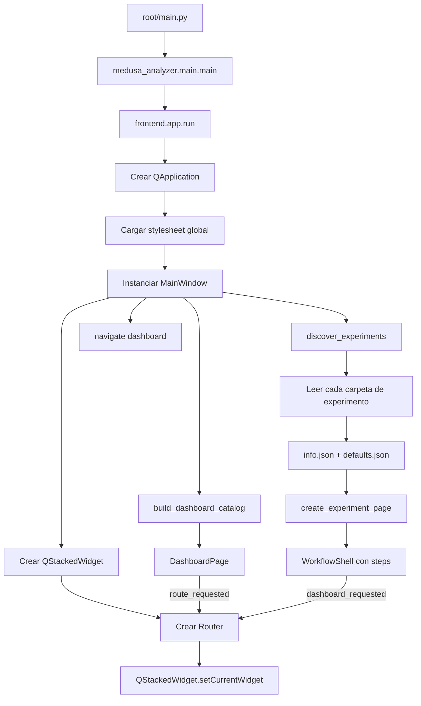
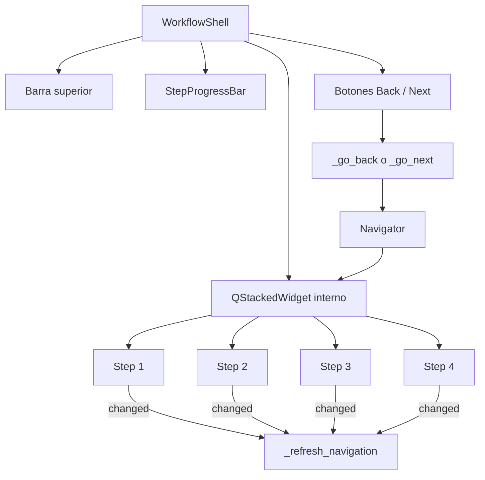
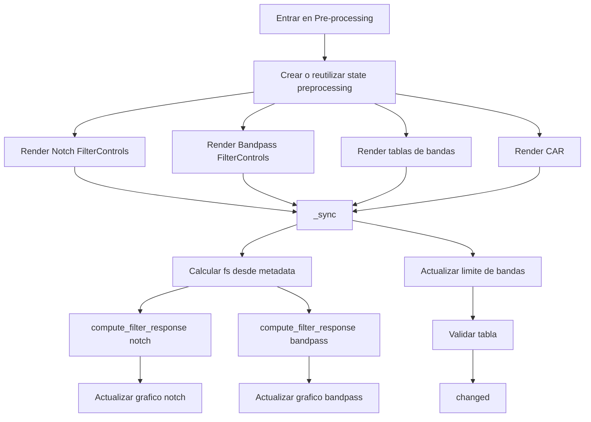
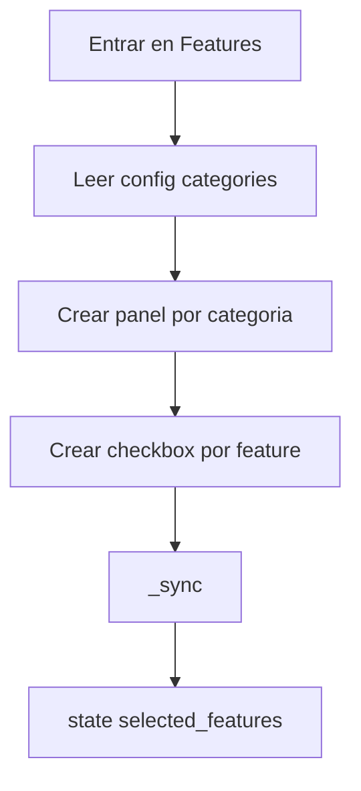
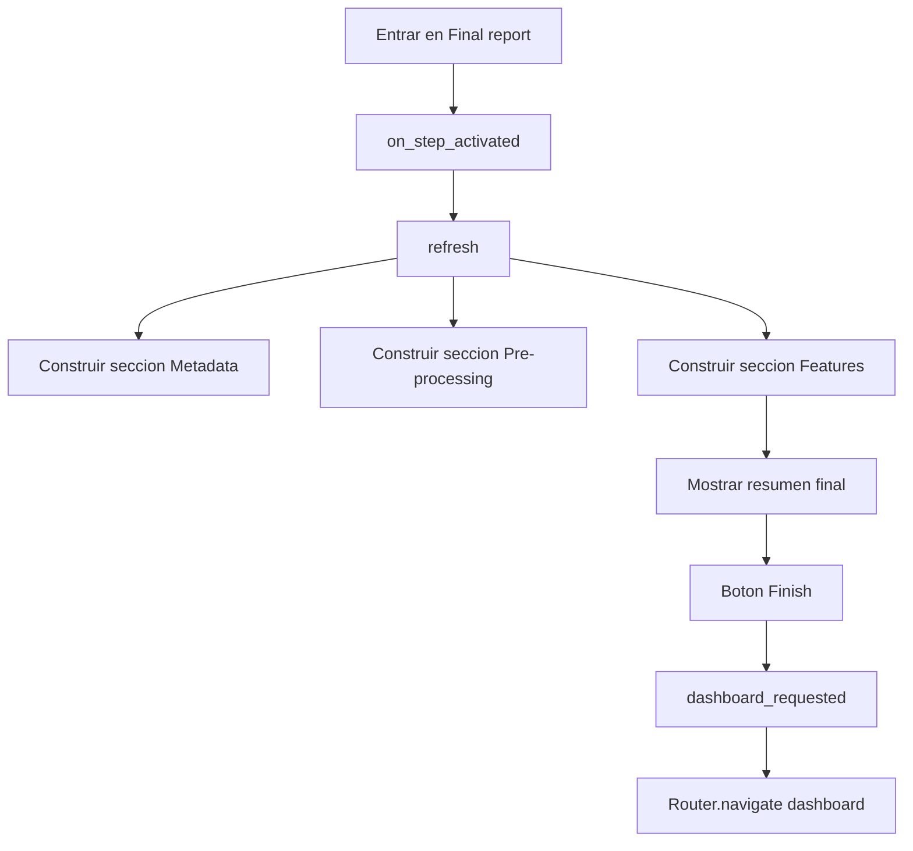
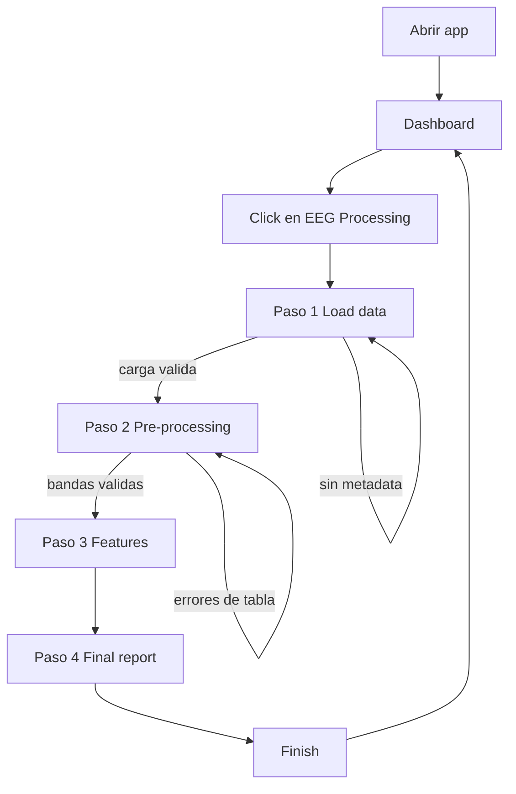

# Flujo completo del proyecto

## 1. Que es este proyecto

`medusa-analyzer-KEOPS` es una aplicacion de escritorio hecha con `PySide6`.
La app monta un dashboard principal y, desde ahi, abre workflows guiados para
experimentos. Ahora mismo el experimento implementado es `EEG Processing`.

La arquitectura esta separada en 2 bloques:

- `backend/`: lectura de datos y logica tecnica de carga.
- `frontend/`: ventanas, widgets, navegacion y estado compartido del flujo.

## 2. Mapa rapido de ficheros importantes

```text
main.py
medusa_analyzer/main.py
medusa_analyzer/frontend/app.py
medusa_analyzer/frontend/router.py
medusa_analyzer/frontend/dashboard.py
medusa_analyzer/frontend/experiments/__init__.py
medusa_analyzer/frontend/widgets/workflow_shell.py
medusa_analyzer/frontend/widgets/load_data.py
medusa_analyzer/frontend/widgets/filtering.py
medusa_analyzer/frontend/widgets/features.py
medusa_analyzer/frontend/widgets/report.py
medusa_analyzer/backend/io/edf_loader.py
medusa_analyzer/frontend/experiments/eeg/info.json
medusa_analyzer/frontend/experiments/eeg/defaults.json
```

## 3. Flujo global de arranque



## 4. Arranque paso a paso

### 4.1 `main.py`

El `main.py` de raiz solo hace de lanzador:

1. Importa `main()` desde `medusa_analyzer.main`.
2. Ejecuta `main()`.
3. Sale con el codigo devuelto.

### 4.2 `medusa_analyzer/main.py`

Este archivo tampoco contiene logica de negocio. Solo delega en:

- `medusa_analyzer.frontend.app.run()`

### 4.3 `frontend/app.py`

Aqui esta el arranque real de la app:

1. Configura logging.
2. Crea o reutiliza `QApplication`.
3. Define nombre de app, organizacion, estilo Qt y fuente.
4. Carga `styles/main.qss`.
5. Crea `MainWindow()`.
6. Hace `window.show()`.
7. Entra en `app.exec()`.

## 5. Como se construye la ventana principal

La clase `MainWindow` hace casi toda la orquestacion de alto nivel.

### 5.1 Stack principal

Se crea un `QStackedWidget` como contenedor de paginas completas. Sobre ese
stack actua el `Router`.

Eso significa que la app no abre ventanas nuevas para cada modulo. Cambia la
pagina visible dentro del mismo stack.

### 5.2 Descubrimiento dinamico de experimentos

`discover_experiments()` recorre `frontend/experiments/` y para cada carpeta:

1. Comprueba que exista `info.json`.
2. Comprueba que exista `defaults.json`.
3. Lee ambos JSON.
4. Valida que `info.json` tenga:
   - `route`
   - `workflow`
5. Construye un `ExperimentDefinition`.

Esto hace que el dashboard y los workflows no esten hardcodeados uno por uno en
`app.py`. Si anades otra carpeta de experimento con su metadata, la app puede
descubrirla.

### 5.3 Creacion de cada pagina de experimento

Por cada `ExperimentDefinition`, `create_experiment_page()`:

1. Crea un `state` compartido.
2. Lee la lista `workflow` definida en `info.json`.
3. Resuelve el widget de cada paso via import dinamico.
4. Instancia el widget con:
   - `experiment.info`
   - `definition.defaults`
   - `state`
5. Mete todos los pasos dentro de un `WorkflowShell`.

### 5.4 Dashboard

Despues `build_dashboard_catalog()` transforma la lista de experimentos en:

- categorias (`DashboardCategory`)
- items clicables (`DashboardItem`)

Con eso se crea `DashboardPage`.

### 5.5 Conexiones de navegacion

`MainWindow` conecta:

- `dashboard.route_requested -> router.navigate`
- `page.dashboard_requested -> router.navigate("dashboard")`

Luego registra en el router:

- `dashboard`
- cada `experiment.route`

Y finalmente abre:

- `router.navigate("dashboard")`

## 6. Router vs Navigator

Hay 2 niveles de navegacion y conviene separarlos mentalmente:

### 6.1 `Router`

Esta en `frontend/router.py`.

Sirve para navegar entre paginas completas:

- dashboard
- pagina del experimento EEG
- futuras paginas de otros experimentos

Hace un `route -> QWidget` y luego usa `stack.setCurrentWidget(page)`.

### 6.2 `Navigator`

Esta en `frontend/navigator.py`.

No navega entre pantallas globales. Navega entre los pasos internos de un
workflow:

- Load data
- Pre-processing
- Features
- Final report

Internamente trabaja con indices de `QStackedWidget`.

## 7. Como funciona el dashboard

```mermaid
flowchart TD
    A[MainWindow] --> B[build_dashboard_catalog]
    B --> C[DashboardPage]
    C --> D[Crear secciones por categoria]
    D --> E[Crear ExperimentCard por item]
    E -->|click si enabled| F[DashboardPage.route_requested(route)]
    F --> G[Router.navigate(route)]
    G --> H[Mostrar pagina del experimento]
```

### 7.1 `build_dashboard_catalog()`

Convierte los experimentos descubiertos en un catalogo visible:

- categoria: por ejemplo `biosignals`
- item: por ejemplo `EEG Processing`

Los datos salen de `info.json`.

### 7.2 `DashboardPage`

Hace estas cosas:

1. Crea un `QScrollArea`.
2. Mete un hero arriba (`DashboardHero`).
3. Agrupa items por categoria.
4. Para cada item crea un `ExperimentCard`.
5. Si el item esta habilitado, conecta el click a la ruta del experimento.

### 7.3 `ExperimentCard`

La tarjeta del dashboard:

- es clickable con raton y teclado
- muestra icono, titulo, subtitle y badge
- emite `clicked`
- solo abre algo si `enabled=True`

En el experimento EEG, el click termina abriendo la ruta:

- `experiment:eeg`

## 8. Como se monta el workflow EEG

El experimento EEG esta definido por 2 archivos:

- `frontend/experiments/eeg/info.json`
- `frontend/experiments/eeg/defaults.json`

### 8.1 `info.json`

Define:

- id del experimento
- titulo y descripcion
- categoria del dashboard
- icono
- ruta `experiment:eeg`
- lista ordenada de pasos del workflow

Pasos actuales:

1. `load_data`
2. `preprocessing`
3. `features`
4. `report`

### 8.2 `defaults.json`

Define la configuracion por defecto de cada paso:

- extensiones de carga
- CAR
- notch
- bandpass
- bandas de frecuencia
- features disponibles
- secciones del reporte

## 9. Estado compartido del workflow

Uno de los puntos mas importantes del proyecto es el `state` compartido.

`create_experiment_page()` crea un diccionario base y se lo pasa a todos los
widgets del workflow. Asi cada paso puede leer lo que hicieron los anteriores.

Estado inicial:

```python
{
    "experiment_id": ...,
    "experiment_title": ...,
    "defaults": ...,
    "loader_results": [],
    "metadata_list": [],
    "loaded_file_paths": [],
    "selected_features": [],
}
```

Durante la ejecucion se anaden o actualizan claves como:

- `preprocessing`
- `selected_features`
- `metadata_list`
- `loader_results`
- `loaded_file_paths`

Importante: el estado usa siempre colecciones. Si hay un solo archivo cargado,
`metadata_list`, `loader_results` y `loaded_file_paths` tienen longitud 1.

## 10. Shell del workflow



`WorkflowShell` hace de contenedor comun para cualquier experimento:

1. Muestra boton `Back to dashboard`.
2. Muestra titulo y subtitulo del experimento.
3. Renderiza la barra de progreso.
4. Mete cada widget paso dentro de un stack interno.
5. Gestiona `Back` y `Next`.
6. Recalcula si el usuario puede continuar.

### 10.1 Regla de `Next`

Cuando pulsas `Next`:

1. `WorkflowShell` llama `can_continue()` del widget actual.
2. Si devuelve `False`, no avanza.
3. Si es el ultimo paso, `Finish` vuelve al dashboard.
4. Si no es el ultimo, hace `navigator.next()`.

### 10.2 Regla de `Back`

Cuando pulsas `Back`:

1. Si estas en el primer paso, vuelve al dashboard.
2. Si no, hace `navigator.back()`.

### 10.3 Regla de activacion

Cuando una pagina pasa a ser visible, si implementa `on_step_activated()`,
`WorkflowShell` la llama. Eso se usa para refrescar datos al entrar en el paso.

## 11. Flujo detallado del paso 1: Load data

```mermaid
flowchart TD
    A[Click en Select EDF files] --> B[QFileDialog.getOpenFileNames]
    B -->|cancelar| C[No cambia nada]
    B -->|seleccionar archivos| D[_clear_loaded_state]
    D --> E[Mostrar nombres en QListWidget]
    E --> F[Mostrar overlay de carga]
    F --> G[Crear Worker con _load_files]
    G --> H[TaskRunner.start]
    H --> I[QThreadPool]
    I --> J[_load_files recorre paths]
    J --> K[load_edf_file por cada path]
    K --> L[Resultado dict con metadata y data]
    L --> M[_loaded(results)]
    M --> N[Guardar state]
    N --> O[Mostrar resumen metadata]
    O --> P[changed]
```

### 11.1 Widget concreto

`EEGLoadDataWidget` no mete logica propia. Solo reutiliza `LoadDataWidget` con:

- `loader=load_edf_file`
- `title="Load EEG data"`
- `description="Select one or more EDF files."`

### 11.2 Que pasa al pulsar el boton

`LoadDataWidget._select_files()`:

1. Abre el selector de archivos.
2. Si el usuario cancela, termina.
3. Limpia el estado de cargas anteriores.
4. Pinta los nombres de archivo elegidos.
5. Esconde el panel de metadata anterior.
6. Muestra texto de estado.
7. Desactiva el boton de seleccion.
8. Muestra `LoadingOverlay`.
9. Lanza un `Worker` en segundo plano.

### 11.3 Carga en background

El `Worker` ejecuta `_load_files()`:

1. Recorre la lista de paths.
2. Llama al loader real para cada archivo.
3. Traduce el progreso individual a progreso global.
4. Devuelve una lista ordenada de resultados.

`TaskRunner` mete ese worker en el `QThreadPool` global de Qt.

### 11.4 Loader real: `load_edf_file()`

El backend implementado ahora mismo es `backend/io/edf_loader.py`.

Ese loader:

1. Lee el archivo completo a bytes.
2. Parsea la cabecera EDF.
3. Extrae:
   - version
   - patient_id
   - recording_id
   - start_date
   - start_time
   - record_count
   - record_duration
   - signal_count
4. Extrae la metadata de cada canal.
5. Recorre todos los records y reconstruye los samples.
6. Convierte de digital a escala fisica si aplica.
7. Construye el array `data` con `numpy`.
8. Devuelve un `dict` con metadata y senal.

Campos relevantes del resultado:

- `path`
- `name`
- `channels`
- `sampling_rate`
- `duration_seconds`
- `n_samples`
- `data`
- `signal_metadata`

### 11.5 Que se guarda en `state`

Cuando el worker termina bien, `_loaded()` guarda:

- `loaded_file_paths`
- `loader_results`
- `metadata_list`

La interfaz tambien recalcula un resumen agregado:

- numero de ficheros
- sampling rate comun o `Mixed`
- numero de canales
- duracion total
- samples totales
- lista de canales

### 11.6 Cuando deja avanzar

`can_continue()` devuelve `True` si existe:

- `metadata_list`, o
- `metadata`

O sea: hasta que no haya una carga valida, `Next` queda deshabilitado.

### 11.7 Limitacion importante

En `defaults.json` el selector permite `.edf` y `.mat`, pero el loader cableado
es solo `load_edf_file()`. No existe un loader `.mat` implementado en el repo.

En la practica, el soporte real actual es EDF.

## 12. Flujo detallado del paso 2: Pre-processing



### 12.1 Que construye este paso

`EEGPreprocessingWidget` monta 3 bloques:

1. Checkbox CAR.
2. Configuracion de filtros:
   - notch
   - bandpass
3. Tabla editable de bandas de frecuencia.

### 12.2 Estado inicial del paso

Si `state["preprocessing"]` no existe, crea uno con:

- `car`
- `notch`
- `bandpass`
- `frequency_bands`

Esos defaults salen de `defaults.json` y de `build_filter_defaults()`.

### 12.3 `FilterControls`

Cada filtro tiene:

- `enabled`
- `low_cut`
- `high_cut`
- `filter_type`: tipo funcional (`bandpass`, `bandstop`, etc.)
- `filter_design`: diseño (`fir` o `iir`)
- `order`: orden del diseño activo
- `window`: ventana FIR o diseño IIR activo

Cada cambio de UI actualiza directamente el `dict` de configuracion del filtro.

### 12.4 Como calcula el sampling rate de referencia

`_sync()` usa esta prioridad:

1. Si hay `metadata_list`, toma el minimo `sampling_rate` positivo.
2. Si no hay ninguno valido, el paso queda bloqueado.

Ese valor manda sobre:

- calculo de respuestas de filtro
- limite de Nyquist
- validacion conceptual de bandas

### 12.5 Calculo de respuesta de filtros

`compute_filter_response()`:

- si el filtro esta deshabilitado: devuelve linea plana `0 dB`
- si los cortes son invalidos: devuelve `None`
- si es FIR: usa `scipy.signal.firwin`
- si es IIR: usa `scipy.signal.iirfilter`
- luego calcula la respuesta en frecuencia

`FilterPreviewPlot` pinta esa respuesta o un mensaje de error.

### 12.6 Tabla de bandas de frecuencia

La tabla `EEGFrequencyBandsTable` reutiliza `EditableTable`.

Capacidades:

- activar/desactivar banda
- editar nombre
- editar `low_cut`
- editar `high_cut`
- reordenar filas con drag and drop
- anadir fila
- resetear a defaults

### 12.7 Validaciones de la tabla

`validate_eeg_frequency_bands()` exige:

- nombre no vacio
- nombre sin espacios
- `low_cut` numerico y finito
- `high_cut` numerico y finito
- `high_cut > low_cut`
- ambos cortes dentro de limites permitidos

### 12.8 Interaccion con el bandpass

Hay un detalle importante:

- el maximo teorico de bandas se recalcula con `fs / 2`
- si el bandpass esta activo, tambien se cruza con `bandpass.high_cut`

Pero la UI de la tabla no reduce el `maximum` del spinbox al nuevo tope. Lo que
hace es validar y marcar error si el usuario deja una banda fuera de rango.

Conclusion:

- la tabla permite escribir un valor alto
- luego bloquea `Next` porque `bands.is_valid()` pasa a `False`

### 12.9 Cuando deja avanzar

`EEGPreprocessingWidget.can_continue()` devuelve:

- `self.bands.is_valid()`

O sea: el paso 2 solo deja avanzar si la tabla de bandas es valida.

## 13. Flujo detallado del paso 3: Features



### 13.1 Que hace

`EEGFeaturesWidget` reutiliza `FeaturesWidget`.

Lee de `defaults.json` las categorias y features disponibles, por ejemplo:

- spectral
- temporal
- nonlinear

### 13.2 Como selecciona por defecto

Si `state["selected_features"]` esta vacio, usa los `checked_by_default` del JSON.

### 13.3 Que pasa al marcar o desmarcar

Cada toggle llama `_sync()` y deja en `state["selected_features"]` la lista final
de ids seleccionados.

### 13.4 Cuando deja avanzar

Siempre:

- `can_continue() -> True`

No hay validacion obligatoria de que haya al menos una feature marcada.

## 14. Flujo detallado del paso 4: Final report



### 14.1 Que hace este paso

`EEGReportWidget` reutiliza `ReportWidget`.

No procesa senal ni guarda resultados. Solo recompone el estado actual y lo
muestra como resumen.

### 14.2 Como se refresca

Cuando el usuario entra en el paso, `WorkflowShell` llama `on_step_activated()`.
Eso fuerza `refresh()` para que el resumen se regenere con el ultimo estado.

### 14.3 Secciones del resumen

Segun `defaults.json`, el reporte puede incluir:

- metadata
- resumen de preprocesado
- features seleccionadas

### 14.4 De donde sale cada dato

#### Metadata

Lee:

- `metadata_list`

Y ensena:

- archivos
- paths
- canales
- sampling rate
- duracion total
- samples totales

#### Pre-processing

Lee:

- `state["preprocessing"]`

Y resume:

- CAR on/off
- notch
- bandpass
- bandas activas

#### Features

Lee:

- `state["selected_features"]`

Y las pinta como lista de ids.

### 14.5 Que pasa al pulsar `Finish`

No hay export ni pipeline final todavia.

`WorkflowShell._go_next()` detecta que estas en el ultimo paso y hace:

- `dashboard_requested.emit()`

Eso devuelve al dashboard.

## 15. Flujo completo de usuario en EEG



## 16. Eventos y senales clave

Las senales Qt que mueven el flujo son estas:

- `DashboardPage.route_requested`
- `ExperimentCard.clicked`
- `WorkflowShell.dashboard_requested`
- `LoadDataWidget.changed`
- `FeaturesWidget.changed`
- `EEGPreprocessingWidget.changed`
- `EditableTable.changed`
- `EditableTable.validation_changed`
- `WorkerSignals.progress`
- `WorkerSignals.result`
- `WorkerSignals.error`
- `WorkerSignals.finished`

## 17. Resumen tecnico de responsabilidades

### Backend

- `edf_loader.py`: parsea EDF y devuelve metadata + muestras.

### Frontend de navegacion

- `app.py`: arranque y wiring general.
- `router.py`: rutas entre paginas completas.
- `navigator.py`: pasos internos del workflow.
- `workflow_shell.py`: contenedor comun de experimento.

### Frontend reusable

- `load_data.py`: seleccion y carga async de archivos.
- `filtering.py`: controles y preview de filtros.
- `features.py`: seleccion de bloques de features.
- `report.py`: resumen final.
- `table.py`: tabla editable generica.

### Experimento EEG

- `info.json`: define el workflow.
- `defaults.json`: define defaults del flujo.
- `eeg_*_widget.py`: adaptadores del experimento sobre widgets genericos.

## 18. Lo que hoy NO hace el proyecto

Con el codigo actual, la app:

- no ejecuta un pipeline real de procesamiento EEG al terminar
- no exporta el reporte a archivo
- no persiste configuraciones entre ejecuciones
- no implementa soporte real para `.mat`
- no lanza calculo de features; solo configura y resume

## 19. Frase corta para entenderlo rapido

La app es un configurador guiado de pipelines: descubre experimentos desde
carpetas, los ensena en un dashboard, comparte estado entre pasos y, en el caso
de EEG, deja cargar EDF, ajustar preprocesado, elegir features y revisar un
resumen final antes de volver al dashboard.
